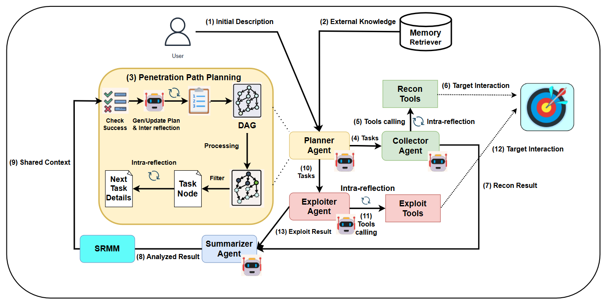

# Red-MIRROR

Red-MIRROR is the implementation accompanying the paper **“Red-MIRROR: Agentic LLM-based Autonomous Penetration Testing with Reflective Verification and Knowledge-augmented Interaction.”** It combines retrieval-augmented generation (RAG), short- and long-term reasoning memory (SRMM), and Dual-Phase Reflection in a multi-agent penetration-testing workflow.

This repository also contains the benchmark harness used to evaluate Red-MIRROR and three baseline systems: AutoPT, PentestAgent, and VulnBot.

> Use this software only on systems that you own or are explicitly authorized to test.

## Architecture



The architecture couples task-level retrieval with SRMM and Dual-Phase Reflection. The Planner coordinates the penetration path, while the Collector and Exploiter execute reconnaissance and exploitation tasks against the authorized target.

## Table of Contents

- [Architecture](#architecture)
- [Prerequisites](#prerequisites)
- [Installation](#installation)
- [Configuration](#configuration)
- [Initialization](#initialization)
- [Running the Benchmark](#running-the-benchmark)
- [Benchmark Output](#benchmark-output)
- [License and Citation](#license-and-citation)

## Prerequisites

- Linux or WSL
- Python 3.10 or later
- `pip` and Python virtual environments
- Docker with Docker Compose
- A MySQL database for Red-MIRROR and VulnBot
- A local or SSH-accessible attack environment with the tools required by the selected system
- Valid credentials for the configured LLM and optional retrieval services

The benchmark definitions are stored under `annotations/Benchmark/xbow` and `annotations/Benchmark/vulhub`. The task list used below is `annotations/Benchmark/benchmark.txt`.

## Installation

```bash
git clone https://github.com/VNUHCM-UIT-InSecLab/Red-MIRROR.git
cd Red-MIRROR
```

Create a separate virtual environment for each system so that their dependencies do not conflict.

### Red-MIRROR

```bash
python3 -m venv venv
./venv/bin/python -m pip install --upgrade pip
./venv/bin/python -m pip install -r requirements.txt
```

### VulnBot

```bash
python3 -m venv VulnBot/venv
./VulnBot/venv/bin/python -m pip install --upgrade pip
./VulnBot/venv/bin/python -m pip install -r VulnBot/requirements.txt
```

### PentestAgent

```bash
python3 -m venv pentest-agent/venv
./pentest-agent/venv/bin/python -m pip install --upgrade pip
./pentest-agent/venv/bin/python -m pip install -r pentest-agent/requirements.txt
```

### AutoPT

AutoPT declares its dependencies in `AutoPT/pyproject.toml` rather than a `requirements.txt` file:

```bash
python3 -m venv AutoPT/venv
./AutoPT/venv/bin/python -m pip install --upgrade pip
./AutoPT/venv/bin/python -m pip install -e ./AutoPT
```

## Configuration

Configure the model provider, model name, database, SSH connection, and optional retrieval services before initialization. Credentials in the distributed configuration files are placeholders and must be replaced only in your local copy.

See [Configuration Guide.md](Configuration%20Guide.md) for Red-MIRROR and [VulnBot/Configuration Guide.md](VulnBot/Configuration%20Guide.md) for VulnBot. PentestAgent and AutoPT use their respective configuration files under `pentest-agent/configs` and `AutoPT/configs`.

## Initialization

Initialize Red-MIRROR from the repository root after configuring and creating its database:

```bash
./venv/bin/python cli.py init
```

Initialize VulnBot separately:

```bash
cd VulnBot
./venv/bin/python cli.py init
cd ..
```

## Running the Benchmark

Run all commands below from the Red-MIRROR repository root. Each runner resets and starts the selected challenge, loads its prompt from `annotations/Benchmark/prompt.csv`, executes the system, and records the result under `annotations/Benchmark/.runtime/experiments`.

Change `--run-id` to `run_2` and `run_3` for subsequent repetitions. A subset of challenge IDs can be supplied directly instead of using `--file`.

### Red-MIRROR

```bash
./venv/bin/python \
    annotations/Benchmark/scripts/run_benchmark_pentest.py \
    --file annotations/Benchmark/benchmark.txt \
    --experiment-name deepseek_full \
    --run-id run_1 \
    --pentest-timeout 900 \
    --continue-on-failure
```

### VulnBot

```bash
./VulnBot/venv/bin/python \
    annotations/Benchmark/scripts/run_benchmark_vulnbot.py \
    --file annotations/Benchmark/benchmark.txt \
    --experiment-name vulnbot \
    --run-id run_1 \
    --pentest-timeout 900 \
    --continue-on-failure
```

### AutoPT

```bash
./AutoPT/venv/bin/python \
    annotations/Benchmark/scripts/run_benchmark_autopt.py \
    --file annotations/Benchmark/benchmark.txt \
    --experiment-name autopt \
    --run-id run_1 \
    --pentest-timeout 900 \
    --continue-on-failure
```

### PentestAgent

```bash
./pentest-agent/venv/bin/python \
    annotations/Benchmark/scripts/run_benchmark_pentest_agent.py \
    --file annotations/Benchmark/benchmark.txt \
    --experiment-name pentestagent \
    --run-id run_1 \
    --pentest-timeout 900 \
    --continue-on-failure
```

Use `--dry-run` with any runner to inspect its planned commands without starting Docker or an agent. Run `<runner> --help` to view all available options.

## Benchmark Output

Results are written to:

```text
annotations/Benchmark/.runtime/experiments/<system-or-configuration>/<run-id>/<challenge-id>/
```

Each completed challenge directory retains:

- `Autopentest.log`: the captured execution log
- `metadata.json`: challenge identity, timestamps, and final exploit status

The runners use `metadata.json.exploit_status` as the recorded benchmark outcome. Keep `.runtime` outputs out of public commits if they contain sensitive local infrastructure details.